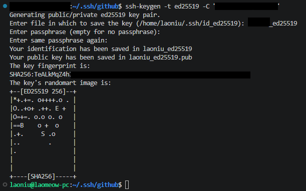
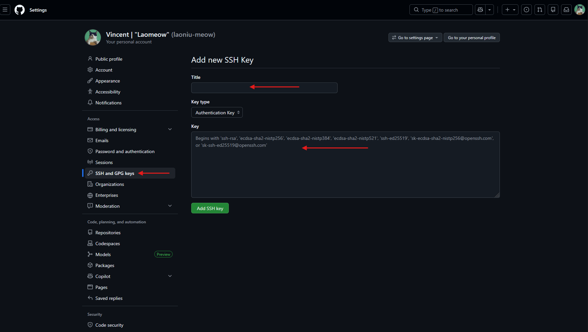

# Generate an SSH key for connecting to GitHub on Linux or macOS
In this guide, we will walk you step-by-step through generating an SSH key on Linux and Mac, connecting it to GitHub, and then practicing how to clone a repository to your local environment

Topic
<ol type = "1">
    <li>Organize the key in specific folder</li>
    <li>Generate a new SSH key</li>
    <li>Start the SSH agent and Add the key to the SSH agent</li>
    <li>Copy the public key</li>
    <li>Add the key to GitHub</li>
    <li>Test the connection</li>
    <li>Use SSH URLs for Git operations</li>
</ol>

---

> Learning Note:
> This is a one-time configuration using the Linux (Ubuntu) or Mac terminal. We will use the CLI, and we encourage you to build confidence in working with it

---

## Organize the key in specific folder
This step is optional, but organizing your files properly will make future navigation easier. For this demo, I will create a .ssh/github folder to store the keys

```bash
# 1. list files and folders, check the folder exist
cd /home/<username>
ls -la                  # Check .ssh exist? 

# 2. if not exist, Create folders
mkdir -p .ssh/github

# 3. Navigate to .ssh/github
cd .ssh/github
```

## Generate a new SSH key
```bash
# 1. Generate key with Ed25519 algorithm
ssh-keygen -t ed25519 -C "your_email@example.com"

# 2. Give a file name for the key:
# Enter file in which to save the key (/home/laoniu/.ssh/id_ed25519): laoniu_ed25519

# 3. Leave the passphrase empty by press 'Enter'
# Enter passphrase (empty for no passphrase): 

# 4. Press 'Enter' again
# Enter same passphrase again: 
```



---

## Start the SSH agent and Add the key to the SSH agent
```bash
# 1. Start the SSH agent
eval "$(ssh-agent -s)"

# Output: Agent pid xxxxxxx

# 2. Add the key to the SSH agent, my key in .ssh/github
ssh-add ~/.ssh/github/<your-key-name>

# Output: Identity added: /home/<username>/.ssh/github/<your-key-name> (your-email)
# If you get this output: Could not open a connection to your authentication agent. Mean that we are not run Start the SSH agent
# If you want to find your key run: ls ~/.ssh/github
# E.g.: id_ed25519 is your private key, and id_ed25519.pub is your public key
```

---

## Copy the public key
```bash
# 1. Display your public key run:
cat ~/.ssh/github/<your-key-name>.pub

# Output: ssh-ed25519 AAAAC3NzaC1lZD........... <your-email> <- Copy the entire line (public key include the email)
```

---

## Add the key to GitHub
<ol type="1">
    <li>Sign in to GitHub</li>
    <li>Go to Settings → SSH and GPG keys</li>
    <li>Click New SSH key</li>
    <li>Give it a title</li>
    <li>Paste the public key</li>
    <li>Save</li>
</ol>



---

## Test the connection
```bash
ssh -T git@github.com

# Output: Hi laomeowmeow! You've successfully authenticated, but GitHub does not provide shell access
```
# Generate an SSH key for connecting to GitHub on Linux or macOS
In this guide, we will walk you step-by-step through generating an SSH key on Linux and Mac, connecting it to GitHub, and then practicing how to clone a repository to your local environment

Topic
<ol type = "1">
    <li>Organize the key in specific folder</li>
    <li>Generate a new SSH key</li>
    <li>Start the SSH agent and Add the key to the SSH agent</li>
    <li>Copy the public key</li>
    <li>Add the key to GitHub</li>
    <li>Test the connection</li>
    <li>Use SSH URLs for Git operations</li>
</ol>

---

> Learning Note:
> This is a one-time configuration using the Linux (Ubuntu) or Mac terminal. We will use the CLI, and we encourage you to build confidence in working with it

---

## Organize the key in specific folder
This step is optional, but organizing your files properly will make future navigation easier. For this demo, I will create a .ssh/github folder to store the keys

```bash
# 1. list files and folders, check the folder exist
cd /home/<username>
ls -la                  # Check .ssh exist? 

# 2. if not exist, Create folders
mkdir -p .ssh/github

# 3. Navigate to .ssh/github
cd .ssh/github
```

## Generate a new SSH key
```bash
# 1. Generate key with Ed25519 algorithm
ssh-keygen -t ed25519 -C "your_email@example.com"

# 2. Give a file name for the key:
# Enter file in which to save the key (/home/laoniu/.ssh/id_ed25519): laoniu_ed25519

# 3. Leave the passphrase empty by press 'Enter'
# Enter passphrase (empty for no passphrase): 

# 4. Press 'Enter' again
# Enter same passphrase again: 
```


---

## Start the SSH agent and Add the key to the SSH agent
```bash
# 1. Start the SSH agent
eval "$(ssh-agent -s)"

# Output: Agent pid xxxxxxx

# 2. Add the key to the SSH agent, my key in .ssh/github
ssh-add ~/.ssh/github/<your-key-name>

# Output: Identity added: /home/<username>/.ssh/github/<your-key-name> (your-email)
# If you get this output: Could not open a connection to your authentication agent. Mean that we are not run Start the SSH agent
# If you want to find your key run: ls ~/.ssh/github
# E.g.: id_ed25519 is your private key, and id_ed25519.pub is your public key
```

---

## Copy the public key
```bash
# 1. Display your public key run:
cat ~/.ssh/github/<your-key-name>.pub

# Output: ssh-ed25519 AAAAC3NzaC1lZD........... <your-email> <- Copy the entire line (public key include the email)
```

---

## Add the key to GitHub
<ol type="1">
    <li>Sign in to GitHub</li>
    <li>Go to Settings → SSH and GPG keys</li>
    <li>Click New SSH key</li>
    <li>Give it a title</li>
    <li>Paste the public key</li>
    <li>Save</li>
</ol>


---

## Test the connection
```bash
ssh -T git@github.com

# Output: Hi laomeowmeow! You've successfully authenticated, but GitHub does not provide shell access
```